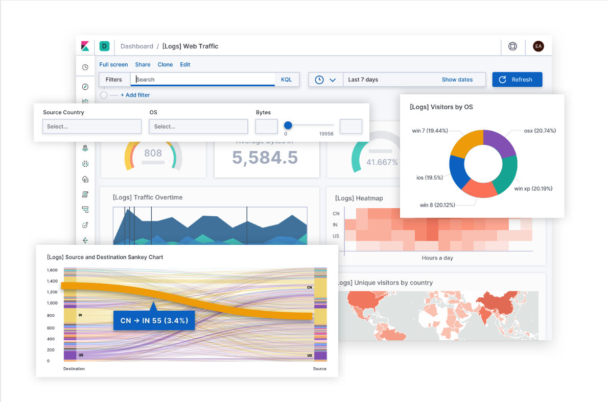
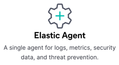
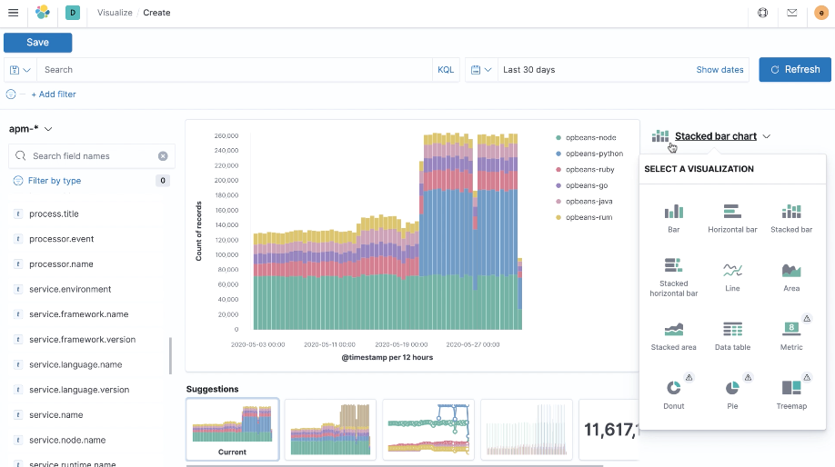
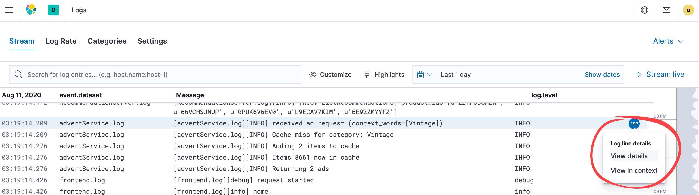

# Elastic Cloud (Elasticsearch managed service) for Java developers running on Microsoft Azure

This document presents an overview of the Elastic Cloud SaaS offering, hosted on Microsoft Azure, focused on the Java developer audience.

Expect to understand what the Elastic Stack is, incorporating Elasticsearch, Kibana, and Beats, as well as the various Elastic product solutions; Enterprise Search, Observability, and Securtiy.

The Elasticsearch managed service on Microsoft Azure is the easiest way to spin up an Elasticsearch cluster, rather than deploying a self-managed environment. This should matter to a Java developer because Java developers are more interested in spending their time developing and enhancing their applications, rather than on infrastructure management and devops.

## Elastic’s products and features

Elasticsearch is a distributed, RESTful search and analytics engine providing Java developers running on Azure with rich features and services. Open source solutions optimized for your use cases, including industry-leading service, monitoring, and support from both Elastic and Azure. Get automatic backups, upgrades and the latest security patches with little downtime or disruptions.

Some of the core Elastic products include:

- [Elastic Stack](https://www.elastic.co/elastic-stack) - The core products: Elasticsearch, Kibana, Beats, and Logstash.
- [Elastic Enterprise Search](https://www.elastic.co/enterprise-search) - Search everything, anywhere.
- [Elastic Observability](https://www.elastic.co/observability) - Unified visibility across your entire ecosystem.
- [Elastic Security](https://www.elastic.co/security) - Unified protection for everyone (combined SEIM and Elastic Endpoint Security).
- [Machine learning](https://www.elastic.co/what-is/elasticsearch-machine-learning) - Find anomalies, forecast trends, and identify areas of interest.

Some of the more applicable features includes monitoring, alerting and reporting, log and metric collection by using [Elastic Beats](https://www.elastic.co/beats) - Elastic’s lightweight data shippers that sit on the edge collecting logs and metrics.

## Create deployments in just minutes on Microsoft Azure

Getting started with Elasticsearch starts with a few simple clicks from the [Azure Marketplace](https://azuremarketplace.microsoft.com). Just search for **Elastic Cloud**, select the **Elastic Cloud (Elasticsearch managed service)** offering.

## Choosing the right deployment solution

When spinning up an Elasticsearch cluster, you will have an option to choose a solution template. Solution template offer a means to rapidly get you running with Elasticsearch, alleviating the need to determine how many nodes are needed, nor how much memory or storage each instance should have.

Every deployment includes a set of components called **instances** which are appropriately sized based on the type of workload selected. These instances include Elasticsearch data, ingest, as well as Kibana for every deployment, but there are additional instances one can include at the time of deployment, or later, such as a machine learning (ML) node, dedicated monitoring nodes, and more. Instance configurations map to [Azure instance types](https://www.elastic.co/guide/en/cloud/current/ec-reference-hardware.html#ec_azure).

Elasticsearch service on Azure provides stability, consistent performance, and greater flexibility, ensuring you always have whatever resources you need, where and when you need them.

The **Elastic Observability** solution template is great for Java developers to choose. You will be able to combine logs, metrics, and application performance management (APM) data, under one unified visibility product, Kibana. This solution offers enhanced insight analysis. Ingesting and then aggregating logs and metrics to produce a relevant search experience is a advantagious for a developer needing a holistic perspective of their environments during development and at run-time.

> [!div class="nextstepaction"]
> [Read more about the various Elastic offered products.](https://www.elastic.co/products)

## Ingesting your data into Elasticsearch

Ingest the types of data which matters most to you, wheter it be Java application or web logs, performance metrics for the JVM or container, or a specifc application module for which Elastic has predeveloped, such as Nginx, Appache, and many more [Metricbeat modules](https://www.elastic.co/guide/en/beats/metricbeat/current/metricbeat-modules.html) and [Filebeat modules](https://www.elastic.co/guide/en/beats/filebeat/current/filebeat-modules.html)!

### Ingest manager

Elastic has made it easy to collect logs, metrics, endpoint security data and other types of data with a unified agent that gets installed on your edge machines. Elastic’s consolidated ingest management approach uses the [Elastic Agent](https://www.elastic.co/blog/introducing-elastic-agent-and-ingest-manager) and offers centralized configuration management with [Fleet mode](https://www.elastic.co/guide/en/ingest-management/current/ingest-management-getting-started.html#agent-fleet-mode), where defining and managing the configuration happens within Kibana using the convenient Configuration Editor.

.

You can still take a more traditional approach with Elastic Agent by configuring YAML files on the systems running it using [standalone mode](https://www.elastic.co/guide/en/ingest-management/current/ingest-management-getting-started.html#agent-standalone-mode).

> [!IMPORTANT]
> Make sure and first read the [limitations with Ingest Manager](https://www.elastic.co/guide/en/ingest-management/current/ingest-management-limitations.html).  

### Filebeat

Throughout your environment, we can assume there are thousands of threads in logs, spread across many different applications, servers, and locations with different format types and even possibly languages that a person in your position must analyze. It is not practical, nor scalable, to try and analyze them by logging onto each system and to parse through those 10s of thousands of lines of text. Rather, there is a much more efficient method to analyze such large amounts of log file data, provided at no additional cost. One in particular is [Filebeat](https://www.elastic.co/beats/filebeat), Elastic’s lightweight data shippers for logs.

Filebeat is one of the many open platform [Beats](https://www.elastic.co/beats) Elastic offers out-of-the-box, ready to help ingesting logs and are [container](https://www.elastic.co/docker-kubernetes-container-monitoring) and cloud-ready. Beats are designed by Elastic to understand your applications, sending relevant data directly into Elasticsearch in a pattern that is understood.

For more detailed instructions, please visit the [Getting Started with Filebeat](https://www.elastic.co/guide/en/beats/filebeat/current/filebeat-installation-configuration.html) reference guide.

### Metricbeat

Metricbeat tailgates Filebeat in our Elasticsearch journey, using Kibana for gaining a holistic point of view of the entire ecosystem. The [Metricbeat System module](https://www.elastic.co/guide/en/beats/metricbeat/current/metricbeat-module-system.html) sends into Elasticsearch: `cpu`, `memory`, `load`, `network` and `processes`, all ready to be visualized in Kibana with predefined dashboards.   

> [!div class="nextstepaction"]
> [Launch a Metrics Quick Start course for free!](https://www.elastic.co/training/metrics-quick-start)

## Elastic Observability

Elastic Observability is not just for the development perspective, nor just for helping with break-fix scenarios. Elastic Observability drives intelligent operational decisions based on gaining an insight as to whom may have been impacted, how they may have reacted, how much money may have been lost, and more. Utilizing machine learning, an optionally enabled service that is used to detect anomalies which can also help prevent unforeseen circumstances in a more proactive manner.

The [APM Server](https://www.elastic.co/apm) ingests data from agents, the open source libraries that sit on your application host which instrument the code and collect performance data and errors at run-time. The [APM Java Agent](https://www.elastic.co/guide/en/apm/agent/java/current/intro.html) can help Java developers by capturing data to help determine the root cause for perhaps a web transaction timing out because a server has run out of cache, a result of seeing anomalies in the heap usage.

This is possible because Kibana brings together the relevant logs and metrics, into one centralized location. The various APM agents capture [instrumented application events](https://www.elastic.co/guide/en/apm/get-started/current/apm-data-model.html) such as spans, transactions, errors and metrics.

## Viewing the data in Kibana

[Kibana](https://www.elastic.co/kibana) is your window into the Elastic Stack, where building and exploring dashboards gives you the ability, and freedom, to bring insights into the hands who need them. Remember the age old saying, “a picture says a thousand words?” Kibana is that same picture, “worth a thousand log lines.” Kibana brings together, not only your Java logs, but the application, system, and container metrics as well.

> [!div class="nextstepaction"]
> [Check out this wonderful Getting Started with Kibana video!](https://www.elastic.co/webinars/getting-started-kibana)

### Dashboards

Kibana dashboards drive insights into the data you need. There are many relevant out-of-the-box dashboards, made from predefined visualizations, which can be customized for whatever use case you desire, whether it be for root cause analysis to building a compelling business decision.

Logs and metrics from applications, systems, containers, cloud resources, and more, are all brought together under one roof. From Syslog analysis, determining what Sudo commands and what SSH logins have been attempted by whom, to understanding why an application is hanging at a certain point, the answers are just a few clicks away within the same interface.

### Kibana Lens

[Kibana Lens](https://www.elastic.co/what-is/kibana-lens) is all about **shaping** your data with an intuitive UI. Lens is a feature of Kibana that allows you to build rich visualizations by using a simple drag-n-drop method. Lens is also very intelligent in that it understands the data you are trying to work with and offers suggestive input, greatly increasing your productivity and efficiency.

There are many different kinds of visualizations that you can create, such as area, bar and line graphs, data tables, heat maps, pie charts and more!

> [!div class="nextstepaction"]
> [Get started with Lens!](https://www.elastic.co/guide/en/kibana/current/lens.html)

### Discover

Discover offers users the ability to create relevant visualizations representing the message data, which alone in its raw format cannot easily be interpreted.

Before using Discover an [index pattern](https://www.elastic.co/guide/en/kibana/current/index-patterns.html) must be created. Fortunately for us, Filebeat provides a basic index pattern we can build off of, so we are not having to start from scratch, but the process is very straightforward. [Our user guides provide more info on creating index patterns](https://www.elastic.co/guide/en/kibana/current/index-patterns.html).

Take advantage of the [sample data set](https://www.elastic.co/guide/en/kibana/current/getting-started.html#get-data-in) that comes with predefined index patterns, visualizations and dashboards. They are a wonderful way to get started with Elasticsearch without worrying about other types of configurations.

Within Discover you can see an ingest of data. Use the [time filter](https://www.elastic.co/guide/en/kibana/current/set-time-filter.html) to expand or narrow the time range and notice the various fields one can filter. Those fields one can filter on have to do with index patters, which can be fully customized based on the type of data being ingested.

### Logs

Developers are very interested in data log analysis, during the development process as well as during run-time. Stream logs live and execute query terms resulting in highly relevant results. Use the [Kibana Query Language](https://www.elastic.co/guide/en/kibana/current/kuery-query.html) or plain text English, and filter by every different type of index available.  

Filebeat provides a default index pattern, a definition table Elasticsearch uses within Kibana for the data as it is ingested and indexed to be searched by field types. Modules are used not only to collect, but to interpret that ingested data. If there are no modules for the types of logs you are ingesting, and you want to manipulate the data before ingesting with Elasticsearch, you can use an [ingest node](https://www.elastic.co/guide/en/beats/filebeat/current/configuring-ingest-node.html) to parse the data.

## Next Steps

> [!div class="nextstepaction"]
> Check out all of the [Elastic features](https://www.elastic.co/elasticsearch/features) and [free training](https://www.elastic.co/training)!
