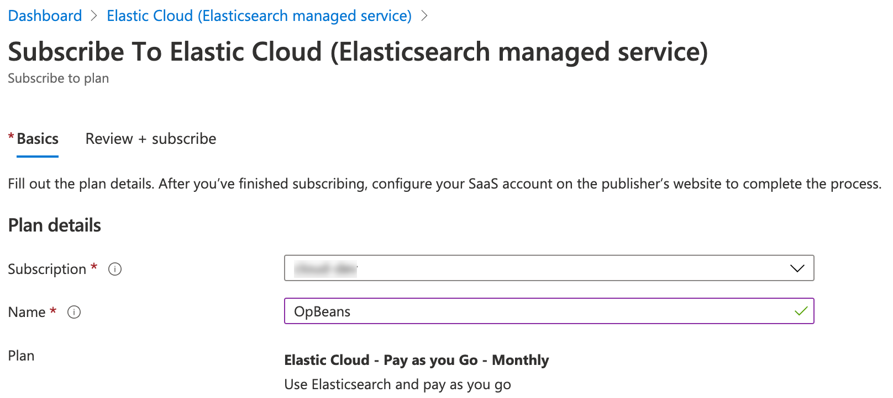
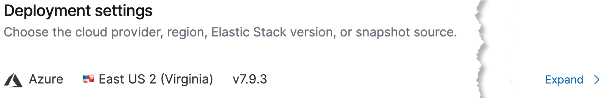

# Tutorial: Getting started with monitoring Java logs using Elasticsearch and Kibana running on Azure

This tutorial shows you how to configure an Elastic Cloud cluster hosted on Microsoft Azure where logs from Java applications are ingested by [Elastic Filebeat](https://www.elastic.co/beats/filebeat) and sent directly to Elasticsearch to be visualised in [Elastic Kibana](https://www.elastic.co/kibana).

If you do not have an Azure account, or would like to sign up with a free trial along with learning about all the amazing features, visit the [Hosted Elasticsearch on Microsoft Azure](https://www.elastic.co/azure) portal page at [elastic.co](https://www.elastic.co/azure).

In this tutorial, you'll learn how to:

> [!div class="checklist"]
> * Deploy an Elastic Cloud managed service cluster on Azure.
> * Install and configure Filebeat on a virtual machine to send Java application logs to Elasticsearch.
> * Visualize Java logs in Kibana.

## Prerequisites

## Spinning up an Elasticsearch Cluster

A good place to start is rom the Azure Marketplace where you can gain a great perspective of the SaaS offering by reading the **Overview**.

From the [Azure Marketplace](https://azuremarketplace.microsoft.com), search for **Elastic Cloud** and then select the appropriate result, similar to the following screenshot. Please note that there are other Elastic offerings, such as Elastic Cloud Enterprise and Elastic Self-Managed products to choose from. We want to select the Elastic Cloud **Managed Service**.

> [!TIP]
> You can also search and add it directly from your Azure portal's [Software as a service](https://portal.azure.com/#blade/HubsExtension/BrowseResourceBlade/resourceType/Microsoft.SaaS%2Fsaasresources) page.

Take some time to read through the **Key Features** and feel free to click on the various **Learn more** links and then click **Get it Now**.

You must agree to the terms in order to continue, at which point, click **Set up + subscribe**.

Choose the appropriate **Subscription** and assign a name such as **My First ES Cluster** (ES for Elasticsearch).

This takes you to the **Elastic Signup** page where you will enter details about yourself and your oganization. You will receive an email shortly with some very useful getting started information, along with a requet to confirm your account.

Once your account has been confirmed, you will be able to **log in**.

You will see the **Create your first deployment** page, where you will click, **Create deployment**.

There are a number of **pre-configured solutions** to build your deployment from, such as bringing your logs, metrics, and APM traces together at scale in a single stack so you can monitor and react to events happening anywhere in your environment by using the **Elastic Observability solution**.

We will select a general all-purpose solution...**Elastic Stack**.

This hosted Elasticsearch Service offers several out-of-the-box deployment templates, simplifying the deployment process. Deployment templates alleviate the strain of knowing how to size a deployment.

The default I/O Optimized template is suitable for most workloads, however, let’s say you have an intensive logging use case, where you need powerful hardware to rapidly access your logging data, yet the business could stand to save on costs. You could select the **Hot-Warm Architecture** deployment template providing powerful access to the “hot” data, optimized for indexing and high search throughput, and based on an **Index Lifecycle Management** policy, the numerous less active logs get moved to the lower costing, lower performing, tier.

Let’s just stick with the default **I/O Optimized** template...

Leave the default **Azure** platform provider, select a **region** closest to you, and leave the default Elastic Stack **version**.

> [!NOTE]
> Changing the version now, or at a later time, is as simple as a few clicks.
Elasticsearch Service hosted on Azure always gives you access to the latest version of the Elastic Stack, security patches, which are available the day they are released, and of course technical support.

Enabling [monitoring](https://www.elastic.co/guide/en/cloud/current/ec-enable-monitoring.html) and [traffic filtering security](https://www.elastic.co/guide/en/cloud/current/ec-traffic-filtering-deployment-configuration.html) options are optional, and we will not need to configure them at this point.

Time to name the deployment...try something like My First ES (for elasticsearch) cluster.
