# Monitoring Java Applications with Elastic Cloud on Azure
This tutorial shows you how to configure **Elastic Cloud (Elasticsearch managed service)** hosted on Microsoft Azure where logs and APM traces from Java applications are ingested by [Filebeat](https://www.elastic.co/beats/filebeat) and [Elastic APM Java Agent](https://www.elastic.co/guide/en/apm/agent/java/current/index.html), respectfully, and then sent directly to Elasticsearch to be visualized in [Kibana](https://www.elastic.co/kibana).

In this tutorial, you'll learn how to:

> [!div class="checklist"]
> * Deploy an Elastic Cloud Elasticsearch managed service cluster on Azure.
> * Deploy Filebeat and Elastic APM Java Agent using Docker, which will send the OpBeans eCommerce logs and APM traces to Elasticsearch hosted on Microsoft Azure.
> * Deploy OpBeans, a Spring Boot demo application that simulates a working Java eCommerce application.
> * Visualize the Java application logs and metrics in Kibana, including outlining how to investigate a simulated error.

## Prerequisites
This tutorial utilizes [Docker Engine](https://docs.docker.com/engine) and [Docker Compose](https://docs.docker.com/compose) to deploy Filebeat and Elastic APM Java Agent which also simulates a real world Java development environment, built from Elastic’s open source [OpBeans](https://github.com/elastic/opbeans-java) Java eCommerce application.

## Lab Setup Details
This tutorial uses a CentOS virtual machine provisioned from the Azure Marketplace which has an appropriate version of Docker Engine and Docker Compose already installed.
Simply search for **docker ce with centos 8.2** and then click **Create**.


##### CentOS version
```
$ cat /etc/centos-release
CentOS Linux release 8.2.2004 (Core)
```

##### Docker Engine version
```
$ docker version
Client: Docker Engine - Community
 Version:           19.03.12
 API version:       1.40
 Go version:        go1.13.10
 Git commit:        48a66213fe
 Built:             Mon Jun 22 15:46:54 2020
 OS/Arch:           linux/amd64
 Experimental:      false
```

##### Docker Compose version
```
$ docker-compose version
docker-compose version 1.23.2, build 1110ad01
docker-py version: 3.6.0
CPython version: 3.6.7
OpenSSL version: OpenSSL 1.1.0f  25 May 2017
```

## Spinning up an Elasticsearch Cluster
Get started with **Elastic Cloud on Azure** from the [Azure Marketplace](https://azuremarketplace.microsoft.com/en-us/marketplace/apps/elastic.ec-azure) using your existing Azure account. This provides integrated billing and stress free management.

Please refer to the [How to Deploy Elastic Cloud on Microsoft Azure](https://cloudblogs.microsoft.com/opensource/2020/10/21/how-to-deploy-elastic-cloud-microsoft-azure) for the steps to deploy Elastic on Azure with the exception of using the Sample Data - we will instead use our own data.

You can name your new deployment **OpBeans** to help identify this setup.

> [!IMPORTANT]
> It is best practice to **create a dedicated user** to be used for this configuration process, rather than the `elastic` user, however, the `elastic` user can be used to get started.
> Please refer to the [Grant user access to secured resources](https://www.elastic.co/guide/en/beats/filebeat/current/feature-roles.html) documentation for more details on creating users to setup, monitor, and write Beats, the minimum roles needed for this user.

##Launch Kibana
Once Kibana is launched you will need to start from the Observability page.

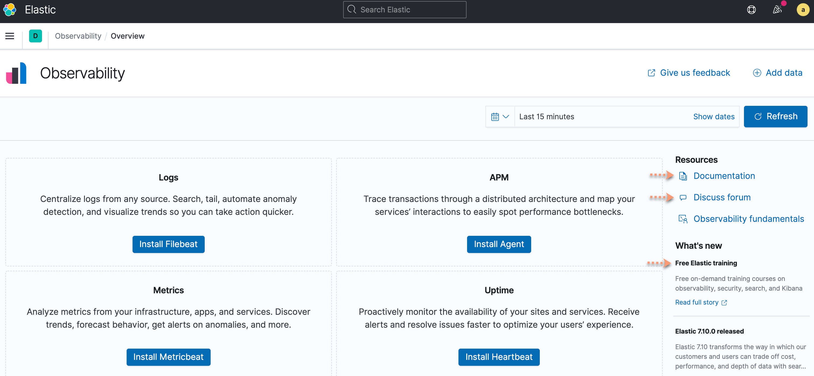

## Setting up OpBeans
Frist, we must setup Filebeat, the Elastic APM Agent, and a simulated Java eCommerce environment, **OpBeans**, in order to provide guidance steps you can simulate in your own environment.

This solution tutorial uses [Docker](https://www.docker.com) containers with a Linux based system (see the prerequisites for more details), providing a rapid and robust solution for such environments.

The process is similar when running locally or on a different type of system. Simply refer to the [Filebeat](https://www.elastic.co/guide/en/beats/filebeat/current/index.html) and [Elastic APM Java Agent](https://www.elastic.co/guide/en/apm/get-started/current/index.html) documentation for more details on getting started.

### Preliminary Steps
These preliminary steps ensure you can simply copy and paste the necessary commands without having to alter them by replacing variables directly within the files themselves. This is also a best practice, rather than hard coding variables in a configuration file.

#### Allowing current user to run Docker as root
In order to utilize system set variables on Linux based systems, set by the current user, you must run Docker as the current user rather than with sudo. Please refer to the [Docker post installation](https://docs.docker.com/engine/install/linux-postinstall) documentation for more details.

These two steps do not apply to Windows systems.

If these steps are not performed, or you are unable to allow this, then you will need to use sudo for all docker commands, and then hard set variables, as running docker with sudo will not pick up user set variables.
Create the docker group by running:

```
sudo groupadd docker
```

Add your user to the docker group.

```
sudo usermod -aG docker $USER
```

#### Setting Environment Variables
There are essentially seven variables needed to be set in order for the commands to run successfully. You can hard code variables in either the configuration files, or directly with commands, however, it is best practice to set them as system variables.

- `ELASTICSEARCH_HOSTS` = the endpoint of the Elasticsearch deployment as seen in the screenshot below.
- `ELASTICSEARCH_USERNAME` = This is the `elastic` user, or preferably a created user as mentioned previously.
- `ELASTICSEARCH_PASSWORD` = Password of the user created, or the password provided during deployment to be used with the `elastic` user.
- `CLOUD_ID` = The entire Cloud ID, as seen in the following screenshot.
- `APM_SERVER` = The APM endpoint as seen in the screenshot below.
- `APM_TOKEN` = The APM token as seen in the second screenshot below.
- `INTERNAL_IP` = The internally assigned IP address of the system.

> [!IMPORTANT]
> The network the VM is using will need a firewall rule applied to accept traffic on port 8000 for the OpBeans web application to be accessible from an external resource, such as your personal laptop. Please refer to the Azure documentation if unfamiliar with this process of creating a firewall rule.

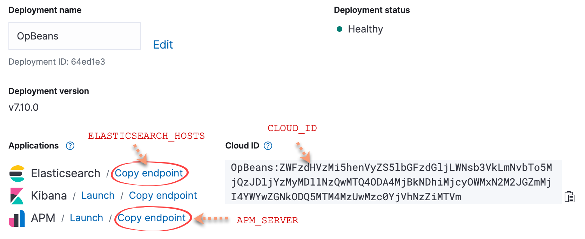


Now that you have collected the information in order to set these seven variables, simply execute the appropriate commands to set these as environmental variables, per your system.
On this CentOS host, the following commands will set the correct environmental variables, assuming you change the values appropriately:

```
export ELASTICSEARCH_HOSTS=<Elasticsearch endpoint>
export ELASTICSEARCH_USERNAME=<created user or elastic>
export ELASTICSEARCH_PASSWORD=<user password>
export CLOUD_ID=<Cloud ID>
export APM_SERVER=<APM endpoint>
export APM_TOKEN=<APM token>
export INTERNAL_IP=<The internal IP address of the system>
```

### Filebeat
The process continues with deploying Filebeat on the CentOS VM provisioned through the Azure portal. Filebeat in this tutorial, is deployed via a Docker container, for which will be utilized as a means of ingesting the OpBeans Java application logs, as well as the container logs themselves - all of which are critical to the health of the ecosystem.

#### Deploying the Filebeat container
This process will download, install, and configure Filebeat which will load predesigned visualizations and dashboards in Kibana, as well as build the necessary indexes.

> [!NOTE]
> The process for setting up Filebeat outside of using containers, simply by following the [Filebeat Quickstart Guide](https://www.elastic.co/guide/en/beats/filebeat/current/filebeat-installation-configuration.html).
> You can therefore skip this first part and jump to the ***Creating the Filebeat configuration file*** section once Filebeat has been deployed on your standalone system.

Run the following commands. You can reference relative steps on Elastic’s [Filebeat on Docker](https://www.elastic.co/guide/en/beats/filebeat/current/running-on-docker.html) documentation.

The command below has been modified slightly due to the use of a Elastic Cloud deployment, versus a local deployment.
```
docker run \
docker.elastic.co/beats/filebeat:7.9.3 \
setup -E cloud.id=$CLOUD_ID -E cloud.auth=$ELASTICSEARCH_USERNAME:$ELASTICSEARCH_PASSWORD
```

Output should look similar to the following:
```
Index setup finished.
Loading dashboards (Kibana must be running and reachable)
Loaded dashboards
Loaded machine learning job configurations
Loaded Ingest pipelines
```
#### Creating the Filebeat configuration file
A Filebeat configuration file is required regardless of deployment type. The name is slightly different, however, so refer to the Filebeat documentation if installing outside of this container tutorial example, as you will modify an existing `filebeat.yml` file - modifying the existing `cloud.id` and `cloud.auth` variables.

The following configuration file, which only applies to container deployments, ensures that Filebeat collects the relevant logs from all Docker containers by default and attempts to parse JSON logs if there are any. Again, non-Docker deployments use the `filebeat.yml` file.

Create a `filebeat.docker.yml` file using a text editor such as Vim, pasting the following.  

> [!IMPORTANT]
> Be very cautious as to the formatting, as YAML files are very particular on the matter. Read more about [YAML formatting problems](https://www.elastic.co/guide/en/beats/filebeat/current/yaml-tips.html).
```
filebeat.autodiscover:
  providers:
    - type: docker
      hints.enabled: true
processors:
- add_cloud_metadata: ~
- decode_json_fields:
    fields: ["message"]
    target: ""
    overwrite_keys: true
    add_error_key: true
output.elasticsearch:
  hosts: '${ELASTICSEARCH_HOSTS:""}'
  username: '${ELASTICSEARCH_USERNAME:""}'
  password: '${ELASTICSEARCH_PASSWORD:""}'
```

The file above takes into account three variables set in in the *Preliminary Steps* section. You can certainly enter these variables directly into this file between the quotes, if preferred, rather than using exported variables, however, hard coding variables is not ideal.
#### Running Filebeat
This step will start Filebeat within the container, with the previously configured configuration file. This will essentially copy it from your local host to the proper location within the container.
Refer to the Filebeat documentation once again, if you are not using the container method, as you must use `setup` and `start` commands, which are quite different.
From your host, run the following:
```
docker run -d \
-e ELASTICSEARCH_HOSTS \
-e ELASTICSEARCH_USERNAME \
-e ELASTICSEARCH_PASSWORD \
--name=filebeat \
--user=root \
--volume="$(pwd)/filebeat.docker.yml:/usr/share/filebeat/filebeat.yml:ro" \
--volume="/var/lib/docker/containers:/var/lib/docker/containers:ro" \
--volume="/var/run/docker.sock:/var/run/docker.sock:ro" \
docker.elastic.co/beats/filebeat:7.9.3 filebeat -e -strict.perms=false
```
#### Validate Filebeat
At this point, you should see the container running and be able to see some logs from Filebeat within Kibana.
Run the following commands to see Filebeat running in the container.

`docker ps`

You will see output such as the following.
```
CONTAINER ID   IMAGE                 COMMAND         CREATED  STATUS   PORTS    NAMES
fd5b24e0b4dd   doc~/filebeat:7.9.3   "/usr/~/dock…"   7 sec~  Up 5 sec~       filebeat
```

You can review the logs by running the following command.

`docker logs <container ID>`

With Kibana open, and from the Observability home page, you should see logs already coming in.


Click **View in app**.


Notice the log histogram depicting the volume of logs being ingested. Oftentimes, a large amount of logs in a short time period can indicate an issue.


Click **Anomalies** when you are ready to set up machine learning alerts, helping to further identify potential problems, before they become issues.

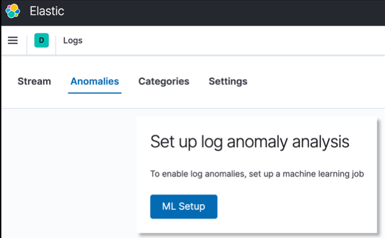

Next, from the navigation menu click **Discover**.


Notice the graph chart showing log count…

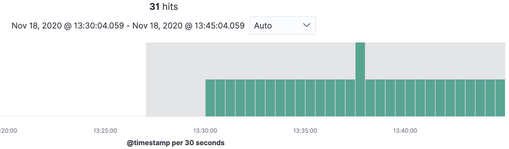

Notice that you can filter on the **Available fields** which will refine the data displayed.

Click **container&#46;name** and notice it only lists **filebeat** for now. Feel free to expand the ingested data and notice you can visualize it in table or raw JASON formats.


### OpBeans
The following steps create an eCommerce simulated Java application called OpBeans, which runs in a container. You can refer to the [OpBeans open source code](https://github.com/elastic/opbeans-java) on GitHub for more information.

The OpBeans container application will send Java trace data to the Elasticsearch cluster, a hosted Elastic Cloud on Azure solution, for which was previously created.

#### Creating the OpBeans Container
Create a `docker-compose-opbeans-only.yml` configuration file by using a text editor such as Vim, with the following information. This file uses the **APM endpoint** , **secret token**, and the **Internal IP** variables set previously.

> [!NOTE]
> If you had not set these variables previously, you will need to hard code them within this file.

```
version: "2.1"
services:
  opbeans-java:
    image: opbeans/opbeans-java:latest
    container_name: opbeans-java
    ports:
      - "$INTERNAL_IP:${OPBEANS_SERVER_PORT:-8000}:8000"
    logging:
      driver: 'json-file'
      options:
          max-size: '2m'
          max-file: '5'
    environment:
      - ELASTIC_APM_SERVICE_NAME=opbeans-java
      - ELASTIC_APM_SERVER_URL=$APM_SERVER
      - ELASTIC_APM_APPLICATION_PACKAGES=co.elastic.apm.opbeans
      - ELASTIC_APM_JS_SERVER_URL=$APM_SERVER
      - OPBEANS_SERVER_PORT=${OPBEANS_SERVER_PORT:-8000}
      - ELASTIC_APM_ENABLE_LOG_CORRELATION=true
      - ELASTIC_APM_ENVIRONMENT=production
      - ELASTIC_APM_SECRET_TOKEN=$APM_TOKEN
    healthcheck:
      test: ["CMD", "curl", "--write-out", "'HTTP %{http_code}'", "--silent", "--output", "/dev/null", "http://$INTERNAL_IP:8000/"]
      interval: 10s
      retries: 10
  wait:
    image: busybox
    depends_on:
      opbeans-java:
        condition: service_healthy
```

#### Running OpBeans
Everything is loaded and ready for runtime. This means that after running the following command, an eCommerce Java based application will be running, for which can be accessed via. a web browser.
Run the following command to start the OpBeans application.
docker-compose -f docker-compose-opbeans-only.yml up

#### Validating OpBeans
Validate that the OpBeans eCommerce application is running by navigating to the IP address using port 8000. This would be the publicly assigned IP Azure provides, rather than the internal one provided with the previous configuration file.

`http://<public-IP>:8000`

Once the web page is loaded, it will look similar to the following, which is the OpBeans Dashboard.

> [!TIP]
> If the web page does not come up, the most common issue is the lack of an open port. This application requires port 8000 be opened from the source host accessing it.

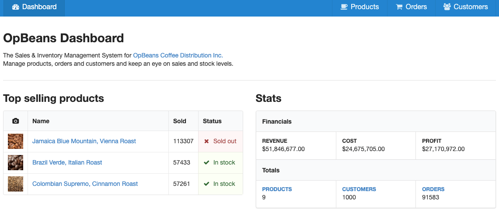

You can also visualize the OpBeans container now in Kibana. Recall the previous step where you select `container.name` under Discover - there will now be two containers.

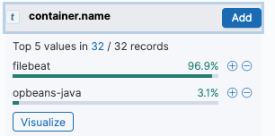

### Adding APM Agent to your environment
There are essentially three ways a Java developer can set up the Elastic APM Java Agent in their own environment. This tutorial's package attaches to the JVM as a standalone application using `apm-agent-attach-standalone.jar`.

There have been no custom code snippets defined to tell APM what to do; no custom instrumentation has been performed. The solution used in this tutorial is completely out-of-the-box.

Please refer to the [Set up the Agent](https://www.elastic.co/guide/en/apm/agent/java/current/setup.html) documentation for more details.

## Visualizing APM Traces
Now that Filebeat and OpBeans are running, it is time to visualize logs and traces in Kibana. We will also simulate an error, to understand where to visualize that data, to help drive a resolution to the identified problem.
From the Home page in Kibana, click **APM**.


Click the **opbeans-java** service and notice the various predeveloped trace visualizations based on current transactions. An explanation of these visuals can be found on the [Transaction overview](https://www.elastic.co/guide/en/kibana/current/transactions.html) documentation at Elastic.

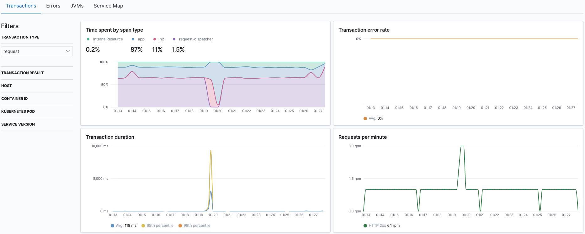

The **Time spent by span type** displays where applications are spending the most time, such as on internal resources, a database, or external calls for example.

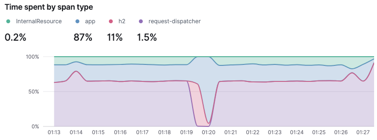

The **Transaction duration** chart displays response times.

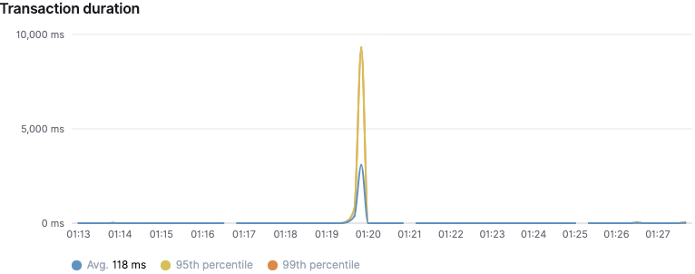

**Requests per minute** displays what response codes are being encountered most often.


The **Transactions** list consolidates transactions with the same name, ordering by the impact.

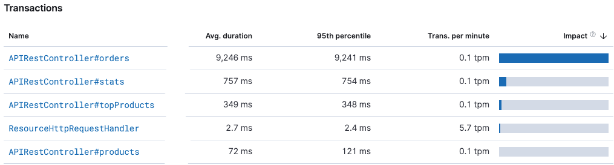

## Invoking a bug
The OpBeans app comes with a built in bug to help highlight what may occur and how to begin to troubleshoot.

Simply add `/is-it-coffee-time` to the end of the URL.

`http://<OpBeans-Server-IP>:8000/is-it-coffee-time`

You will see the following error:


### Analysing the bug
Now from within Kibana, click the **Errors** tab from the **opbeans-java** service page.

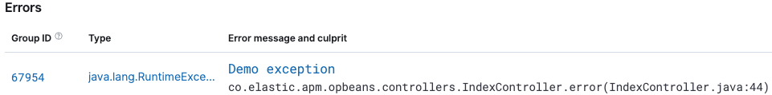

Noice the Group ID, type, and error output. Click **Demo exception** which will take you to the stack trace where you can see all the exceptions. Clicking the **Metadata** tab will provide many details including the URL where the exception took place.
Now click **View 1 occurrence in Discover**.


Expand the details and notice the metadata that points to this error culprit, which you can filter on by clicking the plus sign.


Another very helpful feature is the ability to navigate to the error identified with the documents that occurred within the same period of time.

Simply click **View surrounding documents**.


## Summary
In this tutorial, you learned that spinning up an Elastic Cloud Elasticsearch managed service cluster on Azure is straightforward and follows along with deploying other resources, such as the virtual machine used for deploying Filebeat and the OpBeans Java environment using pre-loaded Docker Engine and Docker Compose.

Take advantage of the [free training](https://www.elastic.co/learn) resources and be sure to visit [Elastic Discuss](https://discuss.elastic.co) where Elasticians, contributors, and end users alike discuss topics of your interest. It is a great way to collaborate and be an active part of the Elastic community.
