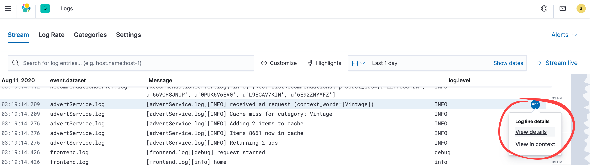

# Tutorial: Getting Started with Elasticsearch Service for Java developers running on Azure

This tutorial shows you how to provision an Elasticsearch Service cluster on Microsoft Azure. We have chosen to walk you through deploying a hosted Elasticsearch Service on Azure, rather than deploying a self-managed environment, as it is the quickest way of spinning up an Elasticsearch cluster.

If you are already familiar with deploying an Elasticsearch cluster, this tutorial still covers very useful information to even more experienced users. It identifies and articulates various benefits applicable for Java developers. At various times, details around the various out-of-the-box solutions are discussed, such as how to ingest data and how Kibana can provide insight into the environment both during development and at run-time..

## Audience

This tutorial is focused for those who wish to deploy Elasticsearch clusters on a hosted platform on Microsoft Azure. This document’s intentions are to assist both Java developers and general practitioners with some of the out-of-the-box tools they can take advantage of with little additional configuration.

This tutorial is focused on helping a Java developer get started with Elasticsearch on Microsoft Azure, but is by no means the only audience that can benefit from it. In addition, this tutorial provides guidance to get started with Elasticsearch, and is in no way meant to be exhaustive to what features exist by utilizing Elasticsearch SaaS hosted on Microsoft Azure.

## Overview

In this tutorial, you'll learn how to:

> * Deploy an Elasticsearch Service cluster on Microsoft Azure.
> * Configure an Elastic APM Java Agent to capture JVM and Java application metrics.
> * Configure an Elastic Filebeat for capturing server system and application logs.
> * Use Kibana for visualizing relevant APM, logs and metrics data.

## Prerequisites
> * An application server, and optionally a Java development environment to work with live data.
> * Optionally check out the various [Getting Started](https://www.elastic.co/videos/) videos to spark your curiosity and to have some expectations while embarking on the Elasticsearch journey.

## Getting Started

From the [Azure Marketplace](https://azuremarketplace.microsoft.com), search for and click on **Elasticsearch Service**. You will see a link to sign up with a free Elasticsearch Service trial along being able to read about the usefulness, depicted under the **Key Features** section. This page is a great starting point for those wishing to embark on the Elasticsearch journey.

## Create a deployment in just minutes on Microsoft Azure

Once an [Elastic Cloud](https://cloud.elastic.co) account is active, after you have signed up, login and click **Create Deployment**. The following process should take just enough time to grab a snack or cup of coffee or tea.

Enter a name for the deployment, such as **azessdemo**

Select **Azure** cloud platform.  

Select a region closest to you.

Optionally choose an **Elastic Stack version**.

> [!TIP]
> The latest version available is always displayed, though can be altered. Keep in mind that updating versions at a later time is trouble free, with little to no downtime and is coordinated by the Elasticsearch services. Additionally, if you have been running the self-managed deployment on Azure, then there are easy ways to migrate depicted on this page.

Choose the **I/O Template** as the type of deployment to use.

### Choosing the right deployment type

Deployment templates are what Elasticsearch provides you, to get up and running on the Elastic Cloud quickly. To get started, there is no need to determine how many nodes are needed, nor how much memory or storage each should have.

Every deployment template includes a set of components called **instances** which are appropriately sized based on the type of workload selected. These instances include Elasticsearch data, ingest, as well as Kibana for every deployment, but there are additional instances one can include at the time of deployment, or later, such as a machine learning (ML) node, dedicated monitoring nodes, an Application Performance Monitoring (APM) server, or when ingesting data from an expansive environment, a coordinating node. Instance configurations map to [Azure instance types](https://www.elastic.co/guide/en/cloud/current/ec-reference-hardware.html#ec_azure).

At Elastic, we understand there is never a one-size-fits all deployment type, and that is why we provide various templates which have customization options, if you should choose. Elasticsearch Service on Microsoft Azure provides stability, consistent performance, and greater flexibility, ensuring you always have whatever resources you need, where and when you need them.

For most general search use cases, the **I/O Template** would be suitable, however, for more specific uses cases, there are other templates which may be more suitable. For example, **hot-warm** templates are typically used for logging use cases. [Hot-Warm Architecture](https://www.elastic.co/guide/en/cloud/current/ec-getting-started-templates-hot-warm.html) configures different tiers of data nodes, with hot data nodes optimised for indexing and high search throughput and warm data nodes optimised for cost effective storage. Index Lifecycle Management Policies ensure that the numerous logs that no longer need to be frequently queried get moved to the **warm data nodes**.

> [!div class="nextstepaction"]
> [Read more about deployment templates](https://www.elastic.co/guide/en/cloud/current/ec-getting-started-templates.html)

## Elastic Observability
The **I/O Optimized** template enables, by default, Elastic APM, an application performance monitoring system. This makes it an ideal deployment template for developers. Elastic APM is one service making up the [Elastic Observability](https://www.elastic.co/observability) solution of apps. Others include Elastic Logs, Elastic Metrics and Elastic Uptime.

Elastic Observability is not just for the development perspective, nor just for helping with break-fix scenarios. Elastic Observability drives intelligent operational decisions based on gaining an insight as to whom may have been impacted, how they may have reacted, how much money may have been lost, and more. Utilizing machine learning, an optionally enabled service offered through the Platinum [Elastic Cloud managed service pricing plan(https://www.elastic.co/pricing), to detect anomalies that can also help prevent unforeseen circumstances in a more proactive manner.

The APM Server ingests data from agents, the open source libraries that sit on your application host which instrument the code and collect performance data and errors at run-time. The APM Java Agent can help Java developers by capturing data to help determine the root cause for perhaps a web transaction timing out because a server has run out of cache, a result of seeing anomalies in the heap usage.

This is possible because Kibana brings together the relevant logs and metrics, into one centralized location. The various APM agents capture [instrumented application events](https://www.elastic.co/guide/en/apm/get-started/7.8/apm-data-model.html) such as spans, transactions, errors and metrics.

> [!div class="nextstepaction"]
> [Read more about Elastic’s APM system](https://www.elastic.co/guide/en/apm/get-started/7.8/overview.html)

> [!TIP]
> Optionally explore additional customization options by clicking **Customize deployment**, and remember to click the **Learn more** links for additional reading.

Click **Create deployment**. Remember to make a note of the password that gets created for the `elastic` user (don’t worry if you forget to take a note of it - you can easily [reset](https://www.elastic.co/guide/en/cloud/current/ec-password-reset.html) the password)

## Launching Kibana

The I/O Template will deploy an instance of Kibana by default. Kibana is [your window into the Elastic Stack](https://www.elastic.co/kibana), where
building and exploring dashboards gives you the ability, and freedom, to bring insights into the hands who need them. Remember the age old saying, “a picture says a thousand words?” Well, Kibana is that same picture, “worth a thousand log lines.”

To launch Kibana, select the **Launch** link within your Deployment page next to Kibana (alternatively, the link is available within the Kibana sub-section under your deployment). To begin with, you can log in with your `elastic` username and password (created when you first created your deployment).

Getting started looking at real world data is as simple as clicking **Try our sample data**, which not only loads the sample data, but also sample dashboards and more. This option is great to get familiar with Kibana and its features, and immediately see the power of Kibana, where everyone can see the benefits in creating, customizing and utilizing all the amazing dashboards containing histograms, graphs, pie charts, maps and more!

Check out this wonderful [Getting Started with Kibana](https://www.elastic.co/webinars/getting-started-kibana) video!

The purpose of this tutorial is to get you ingesting your own data that you can search and visualize  in Kibana, and that is what we will proceed with doing.

## Ingesting your data into Elasticsearch and visualizing it in Kibana

Assuming you had taken the advice and watched some of the great Getting Started videos, especially the Getting Started with Kibana video, and got excited about what you saw. We can get you exploring your own data in the same way, by following the rest of this tutorial.

What types of data matters to you? Are you most interested in the performance metrics for the application, JVM, container, or cloud platform? Do you need to analyze thousands of lines of log files from many different kinds of sources, all in one location just to find out why your users cannot connect, or why an app is running slow, or not running at all?

You can find answers to these questions and more in Kibana.


### Placeholder for offering a secondary option for ingesting with Elastic Agent per Gail….

### Installing Filebeat to ingest logs

Throughout your environment, we can assume there are tons of threads in logs, spread across many different applications, servers, and locations with different format types and even possibly languages that a person in your position must analyze. It is not practical, nor scalable, to try and analyze them by logging onto each system and to parse through those 10s of thousands of lines of text. Rather, there is a much more efficient method to analyze such large amounts of log file data, provided at no additional cost. One in particular is [Filebeat](https://www.elastic.co/beats/filebeat), Elastic’s lightweight data shippers for logs.


Filebeat is one of the many open platform [Beats](https://www.elastic.co/beats) Elastic offers out-of-the-box, ready to help ingesting logs and are [container](https://www.elastic.co/docker-kubernetes-container-monitoring) and cloud-ready. Beats are designed by Elastic to understand your applications, sending relevant data directly into Elasticsearch., or to [Logstash](https://www.elastic.co/logstash) for further processing. With Logstash, you can apply many data manipulation techniques, such as applying transformations, to data before being indexed in Elasticsearch. There is also a large amount of [community Beats](https://www.elastic.co/guide/en/beats/libbeat/7.8/community-beats.html) which means that most likely, anything you may need has already been developed, or offers a great starting point to build off of.

Configuring Filebeat begins within Kibana, where clear instructions are depicted. The setup depends on your system, but essentially consists of downloading, configuring the **filebeat.yml** file, which consists of setting what to collect, and where they need to go, and then running the setup commands. The process generally takes under five minutes.

Additionally, you may want to enable modules relevant to your environment, such as if you are running Nginx or MySQL. There is also a **Systems Logs module**, which you can enable upon installing Filebeat. Check out all the out-of-the-box types of [Elastic Integrations](https://www.elastic.co/integrations). Many come with pre-built dashboards and visualizations, getting you up and running even faster!  

> [!NOTE]
> Filebeat guarantees at-least-once delivery and from then on keeps track of the last lines sent by utilizing [harvesters](https://www.elastic.co/guide/en/beats/filebeat/7.8/how-filebeat-works.html#harvester). There is a *registry* that rebuilds the state should Filebeat get restarted. If that registry gets corrupted or deleted, then all the logs will need to be re-sent to Elasticsearch.

We will install Filebeat along with adding a system log monitoring module. Once Filebeat is installed, any of the modules that ship with it can be enabled by running a few simple commands. For more detailed instructions, please visit the [Getting Started with Filebeat](https://www.elastic.co/guide/en/beats/filebeat/7.8/filebeat-getting-started.html) reference guide.

From the Home page, click **Add log data**.

Choose **System logs**.


Choose your application host’s operating system to follow the instructions.

> [!IMPORTANT]
> During the second step, we will want to make one additional configuration change to the *filebeat.yml* file in order to also collect the relevant log data you wish to import into Kibana.

In order to make a connection between the application server and Elasticsearch, you must set two variables, the `cloud.id`, which has been provided, and the `cloud.auth`, requiring you to just modify the &lt;password&gt;.

> [!IMPORTANT]
> That password is the same one used to launch Kibana, so if you change that password, all agents and modules will need to be updated.

While the filebeat.yml file is still open, at the top you will see a section called `filebeat.inputs`. This is where you will point to your logs, or log directories, for Filebeat to ship to Elasticsearch. Please follow the embedded instructions within that file or use the [Filebeat configuration reference guide](https://www.elastic.co/guide/en/beats/filebeat/7.1/filebeat-configuration.html), and don't forget to enable it!

```Sample filebeat.yml log input configuration
filebeat.inputs:
- type: log
 enabled: true
 paths:
   - /var/log/*.log
```
Notice that `enabled` must be set to `true`.

> [!IMPORTANT]
> Please take precautions when modifying [YAML](https://yaml.org) files, as things like indentations, or spaces, are interpreted as a type of configuration. Please refer to our [YAML documentation](https://www.elastic.co/guide/en/beats/filebeat/7.8/yaml-tips.html) for more details.

Finish by following the steps depicted in Kibana.

#### Enabling additional modules

Why stop at simply ingesting system and file logs? Why not include logs from [Apache](https://www.elastic.co/guide/en/beats/filebeat/7.8/filebeat-module-apache.html), [Azure](https://www.elastic.co/guide/en/beats/filebeat/7.8/filebeat-module-azure.html), [Kafka](https://www.elastic.co/guide/en/beats/filebeat/7.8/filebeat-module-kafka.html), [Nginx](https://www.elastic.co/guide/en/beats/filebeat/7.8/filebeat-module-nginx.html) or [Redis](https://www.elastic.co/guide/en/beats/filebeat/7.8/filebeat-module-redis.html)? The process is more or less the same where you enable the module and then create a configuration modification.

Check out all the [out-of the-box modules](https://www.elastic.co/guide/en/beats/filebeat/7.8/filebeat-modules.html). Most come with visualizations and pre-built dashboards.

### Installing Metricbeat to collect system metrics

Metricbeta tailgates Filebeat in our Elasticsearch journey since they are companions and support the benefit of using Kibana as a holistic point of view into the environment. They are partners, companions...What good are a bunch of logs without other metrics supporting your search results?  

The [Metricbeat System module](https://www.elastic.co/guide/en/beats/metricbeat/7.8/metricbeat-module-system.html) is what we will be installing, as it will be a great starting point. Metrics such as cpu, memory, load, network and processes are able to be monitored and incorporated into a search result alongside log data, driving towards a more refined and relevant search result, perhaps when looking for why an application is not behaving appropriately.

As with the Filebeat system and log module, the Metricbeat system module comes with a predefined dashboard, which means all you have to do is configure the module and voilà, you have a beautiful set of visualizations. What is more is that Kibana will bring the two sets of data together, building on the true benefit of having a unified visibility across your entire ecosystem known as [Elastic Observability](https://www.elastic.co/observability).  

Clicking the Elastic :::image type="icon" source="media/java-get-started-with-elasticsearch/es-icon.png"::: icon to navigate to the Kibana Home page.

Click **Add metric data**.

Choose **System metrics**.


Choose your application host’s operating system and follow the instructions. The basics are the same for the Filebeat modules, where you will download, install and then configure the metricbeat.yml file with the appropriate settings such as `cloud.id` and `cloud.auth`.

## Viewing the ingested data in Kibana

### Logs

A developer will be very interested in data log analysis, during the development process as well as during run-time. On the side navigation, find the Observability section, and click **Logs**. This is one area where logs are centralized and visualized, and can even be streamed in real time by clicking on **Stream live** in the upper right side of the screen. Query terms can be searched using [Kibana Query Language](https://www.elastic.co/guide/en/kibana/7.8current/kuery-query.html) or plain EnglishThe time filter can be customized and term can be highlighted.

> [!NOTE]
> Filebeat provides a default index pattern, a definition table Elasticsearch uses within Kibana for the data as it is ingested and indexed to be searched by field types. That default index pattern may not be appropriate for all data ingest types. In Logs, you can change the index pattern, for example, if the data does not have a standard timestamp which is used for sorting by clicking [Settings](https://www.elastic.co/guide/en/logs/guide/7.8/configure-logs-source.html).

Please start by searching for a particular event, such as errors, by entering **mozilla** in the query bar, or just typing any term. as  Notice the log histogram on the right side, an indication of when log entries were ingested. This can be helpful to see from a high level, when a large number of logging events took place.

View more details by clicking the **Log line details**.



### Discover

Discover offers users the ability to create relevant visualizations representing the message data, which alone in its raw format cannot easily be interpreted.

Before using Discover an [index pattern](https://www.elastic.co/guide/en/kibana/7.8/index-patterns.html) must be created. Fortunately for us, Filebeat provides a basic index pattern we can build off of, so we are not having to start from scratch, but the process is very straightforward. [Our user guides provide more info on creating index patterns](https://www.elastic.co/guide/en/kibana/7.9/index-patterns.html). .

> [!TIP]
> To get started with Discover and other visualizations, you can take advantage of the [sample data set](https://www.elastic.co/guide/en/kibana/7.8/getting-started.html#get-data-in) that comes with built-in index patterns, visualizations and dashboards. They are a wonderful way to Get Started with Elasticsearch.


Within Discover you can see an ingest of data. Take advantage of the [time filter](https://www.elastic.co/guide/en/kibana/7.8/set-time-filter.html) to expand or narrow the time range.

> [!TIP]
> By default, the time filter is set to the last 15 minutes, therefore you may need to adjust it to a larger time frame if you do not see any data.

Make sure that you are able to bring in different data indexes by selecting the **Change Index Pattern** dropdown. For example, in the screenshot you can see that **filebeat*** is selected.


Notice the various available fields. Because log files are very different, creating customized index patterns will be something advantageous to do, however, since we have a good baseline to work from, since we have installed the filebeat system module, we can utilize a few known fields sure to be similar and helpful for exploring data in a relevant way.

We will show you how to filter down data to be able to visualize what is important for you.

Scroll down to where it says **host.os.platform** and then click **Add**, followed by **process.name** and finally **message**.

What you are now left with is *filtered* data that makes it easy to determine what is going on with each system based on platform and relevant service.

Now, click on **process.name** where it will then expand showing you various processes running. Choose one by, and clicking the plus sign to the right. This will filter even more, providing perhaps an indication of what that process may be involved with. Clicking the minus sign does not remove the filter, rather, it is a logical operator NOT and will prevent what is selectedany of those services from displaying; a suppression of sorts.

If there is not a process that you would like to investigate is not listed, as only the top five are displayed, simply utilize the **Add filter** function.

Click **Add filter** under the search bar.

Enter **process.name** for the field then be sure and click the name once it is displayed.

Select **is** for the operator.

Select a value such as **sudo**. This is a great value to search and filter for when needing to know how people are using sudo credentials.

Click **Save**.

To add a little more insight for sudo, remove **message** and add **host.name** and **system.auth.sudo.command**. You can expand the entry to gain more information in Table and JSON formats.

> [!TIP]
>  You can move various columns by hovering your mouse over the column name.

Since we do not know what specific application logs you have ingested, or plan to ingest, the steps above should be able to be translated into whatever data explorations you wish to have. Your journey is just beginning, and we encourage you to take advantage of the [Free Fundamentals training](https://www.elastic.co/training/free#quick-starts) such as [Kibana Fundamentals](https://www.elastic.co/training/kibana-fundamentals).   

### Kibana Lens

You have learned how to shape data with Discover, providing a more relevant search experience. Let us now jump into **shaping** your data with [Kibana Lens](https://www.elastic.co/guide/en/kibana/7.8/lens.html). Lens is an amazing feature of Kibana that allows you to build amazingly rich visualizations by a simple drag-n-drop method. Lens is also very intelligent in that it understands the data you are trying to work with and offers suggestive input, greatly increasing your productivity and efficiency.

From Kibana Home, click **Visualize**.

Click **Create visualizations**.

> [!TIP]
> Feeling a bit nervous about creating your own visualizations? Check out the out-of-the-box visualizations that come with the Beats you have already installed and configured, such as "SSH login attempts [Filebeat System] ECS."

Notice the different kinds of visualizations that you can create such as area, data tables, heat maps, bar and line graphs, pie charts and more!

Click **Go to Lens**, the new intuitive way to create visualizations.

Make sure to have selected the **filebeat-*** index pattern.

Let us start with some basics. Drag and drop **@timestamp**. You should already see something, and it may just be one or two long vertical bars. Remember that you may need to adjust the time filter, which can be done by dragging your mouse over the area you want to zoom into.

Next drag and drop **process.name**.

You should already start to see the benefits of what this tool can do. If you do not see enough data, simply expand the timeframe.

You can also change the chart type by either clicking on a suggestion Lens provides, or by selecting a new visualization type from the drop down where it shows the current type on the right side.  

### Dashboard

Please do notice the various visualizations that come out-of-the-box in dashboards for Syslog, Sudo commands, SSH logins and New users and groups.

From Kibana Home, click on **Dashboards** and search for *sys*. Try it out by running a few sudo commands on your system with Filebeat configured, or connecting with SSH including throwing in a bad credential, looking at their respective dashboards.

> [!TIP]
> Don’t see anything new, be sure to click **Refresh** in the upper right side of the screen, or set the refresh rate by clicking the calendar icon just to the left of the Refresh button.
